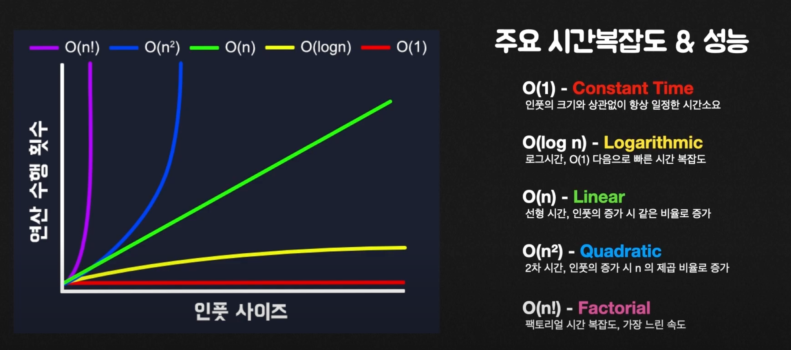

**big O표기법이란**

- 알고리즘의 직접적인 모든 연산 횟수를 계산하는 것이 아닌 인풋의 증가에 따른 연산 처리시간의 증가율을 예측하는 척도
  
- O(log n) - 이진 트리
  ```tsx
  function logCounter(n) {
    let loopCount = 0;
    for (let i = 2; i <= n; i *= 2) {
      loopCount++;
    }

    return loopCount;
  }

  logCounter(16); // 4
  ```
- O(n) - linear time 선형 시간 복잡도, 인풋 증가에 비례
  - 이보다 느리면 비효율적으로 봄
  ```tsx
  function countCharacters(str) {
    let count = 0;

    for (let i = 0; i < str.length; i++) {
      count++;
    }

    return count;
  }
  ```
- O(n2) - Quadratic time, 2차 시간 복잡도, 인풋의 증가 시 n의 제곱 비율로 증가
  ```tsx
  function buildMatrix(arr) {
    let matrix = [];

    for (let i = 0; i < arr.length; i++) {
      matrix[i] = [];

      for (let j = 0; j < arr.length; j++) {
        matrix[i].push(arr[j]);
      }
    }

    return matrix;
  }
  ```
- O(n!) - factorial time, 팩토리얼 시간 복잡도, 가장 느린 연산
  ```tsx
  function factorial(n) {
    let num = n;

    if (n === 0) return 1;
    for (let i = 0; i < n; i++) {
      num = n * factorial(n - 1);
    }

    return num;
  }
  ```
